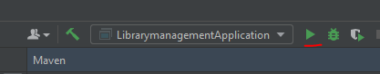

# Library Management System - Sistema de Gestión de Biblioteca

## Overview

The Library Management System, or "Sistema de Gestión de Biblioteca," is a software application designed to manage the operations of a library. This system offers essential features to manage books, magazines, newspapers, computer resources, and meeting rooms. It offers functionalities for rental, return, and reservation.

## Key Features

1. **User Registration**: Users can be registered with essential details such as identifier, name, last name, email, and phone number.

2. **Cataloging Items**:
   - Books: Information like identifier, title, author, and publication year can be recorded.
   - Magazines: Records include identifier, name, and publication date.
   - Newspapers: Record details comprise identifier, headline, and date.

3. **Resource Management**:
   - Computers: Available computers can be registered for rental, including brand and model information.
   - Meeting Rooms: Users can book meeting rooms with data on the identifier, name, and location.

4. **Listing Resources**:
   - Users can view lists of available books, magazines, and newspapers, filtering by availability or viewing all resources by default.
   - A similar functionality is available for users, computers, and meeting rooms.

5. **Rental and Return**:
   - Registered users can rent books, magazines, and newspapers, with detailed records of the borrower and return date.

6. **Computer Reservation**: Users can reserve library computers, with recorded user details and date and time of reservation.

7. **Meeting Room Booking**: Users can book library meeting rooms for specific purposes, with records of the reserver and booking date and time.

8. **Bonus Search Feature**:
   - Users can search for specific books, magazines, and newspapers by title, name, or headline, respectively.
   - The system indicates the availability of the item, and if not found, custom exceptions (BookNotFoundException, MagazineNotFoundException, NewspaperNotFoundException) are raised.

## Technical Requirements

- The system is developed using Spring Boot in Java 17.
- Comprehensive testing has been conducted for all system operations to ensure robustness and reliability.

## Installation

To RUN in IntelliJ:
 

## License

- This project is licensed under the [MIT License](LICENSE.md).